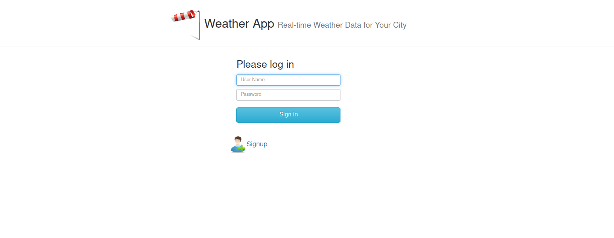
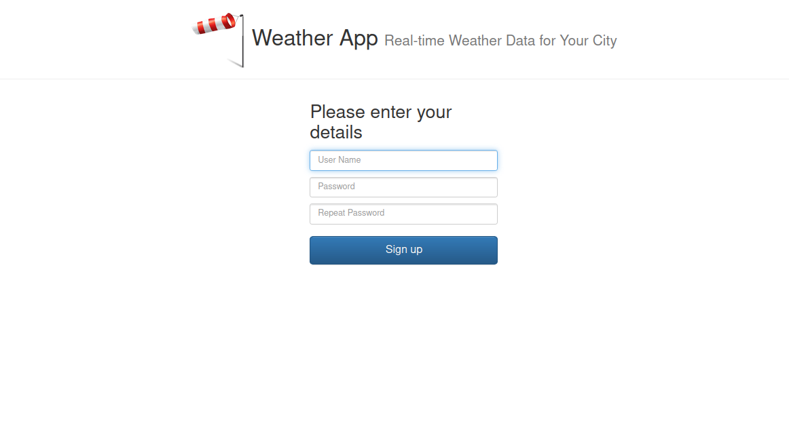
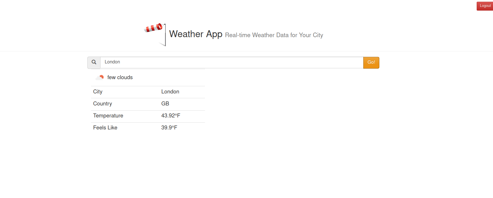

# 🌦️ Weather App

> **A simple web application to display weather conditions in different cities using the OpenWeather API.**

## 🚀 **Description**
This app allows users to search for the weather of any city and displays information such as:  
- Weather condition description 🌤️  
- Current temperature 🌡️  
- Feels-like temperature 👕  
- City and country name 🏙️  

## 🛠 **Technologies Used**
- **Frontend:** HTML, CSS, JavaScript, jQuery  
- **Backend:** Node.js, Express
- **Authentication Service:** Go  
- **API:** Rapid_API OpenWeather
- **Caching:** Nginx  
- **Containerization:** Docker, Docker-Compose  

## 📷 Application Screenshot

To add a screenshot of the application, place the image in the repository and reference it as shown below:





   ```sh
   # in .env Add the following
   DB_USER= ...
   DB_PASSWORD= ...
   DB_NAME= ...
   APIKEY= ...
   MYSQL_ROOT_PASSWORD= ...
   MYSQL_DATABASE= ...
   ```

## 🔧 **How to Run**
 **Run the application using Docker-compose :**  
   ```sh
   docker-compose up -d
   ```
 **Show the status**
   ```sh
   docker-compose ps
   ``` 
 **Bring the application down**
   ```sh
   docker-compose down
   ``` 
## 🚀 **Overview**

The **Weather App** is a simple web application that allows users to retrieve real-time weather information for any city. It fetches weather data from an external API and displays key details such as temperature, weather conditions, and location. 

This project is designed for practicing **DevOps** concepts, including **API integration, and web application deployment**.

---